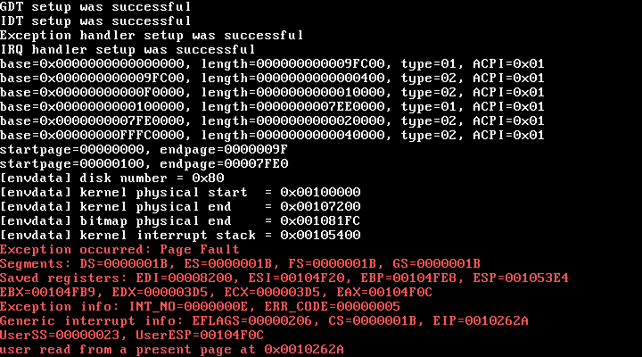

# egg-kernel
egg-kernel is an x86 kernel written in C.

# how to build?
Building the kernel is easy, just run `build.sh`. However, it has a few dependencies:

* `dd`, to write files to disk image
* `nasm`, to assemble assembly
* `i686-elf-gcc`, to compile C code

`dd` and `nasm` can both be easily installed through various package managers, but you may have to build the cross-compiler yourself. There's a good resource on how to do this hosted by the [OSDev wiki](https://wiki.osdev.org/GCC_Cross-Compiler). It's admittedly a slow and painful process, so you may want to find a prebuilt i686-targeting toolchain for your host OS.

**The Makefile isn't finished yet. You can't use it to compile the kernel.**

# how to run?
For the sake of simplicity, egg-kernel relies on the "old" way of booting (bootsector, BIOS, etc). So, you must run it in an emulator or on a machine that supports MBRs. Most machines still support this option, but some newer ones don't.

There are some BIOSes which have certain unwritten expectations about an OS's bootsector, ones which egg-kernel's probably doesn't fulfill. On the off chance that you encounter one, please create an issue.

Running egg-kernel in an emulator is incredibly easy. For QEMU:

```
qemu-system-i386 -hda disk.hdd
```

# what does it look like?

Not much. egg-kernel is extremely early in development.

